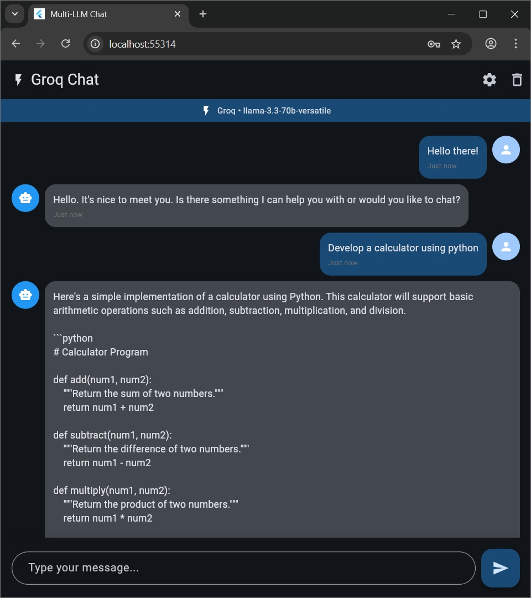
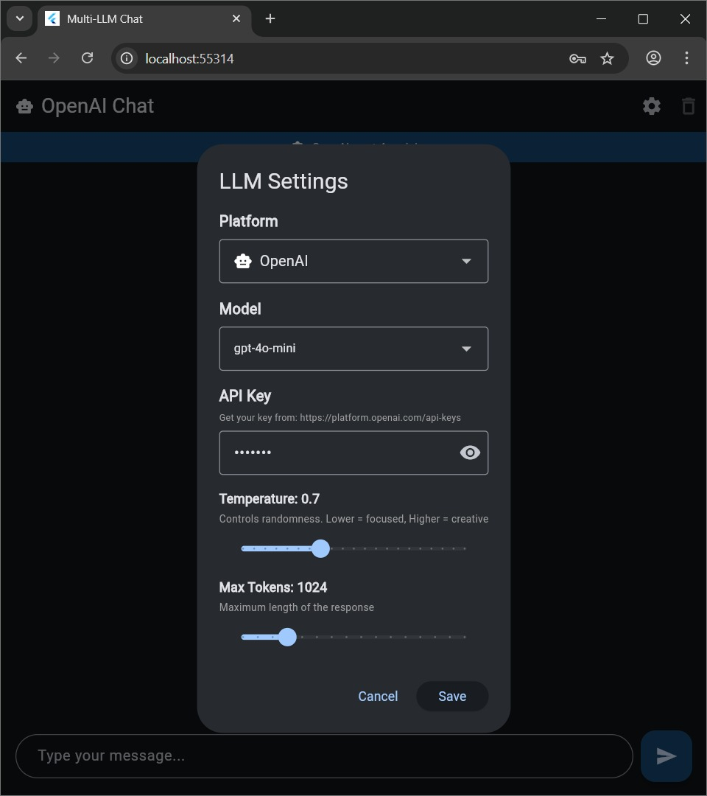
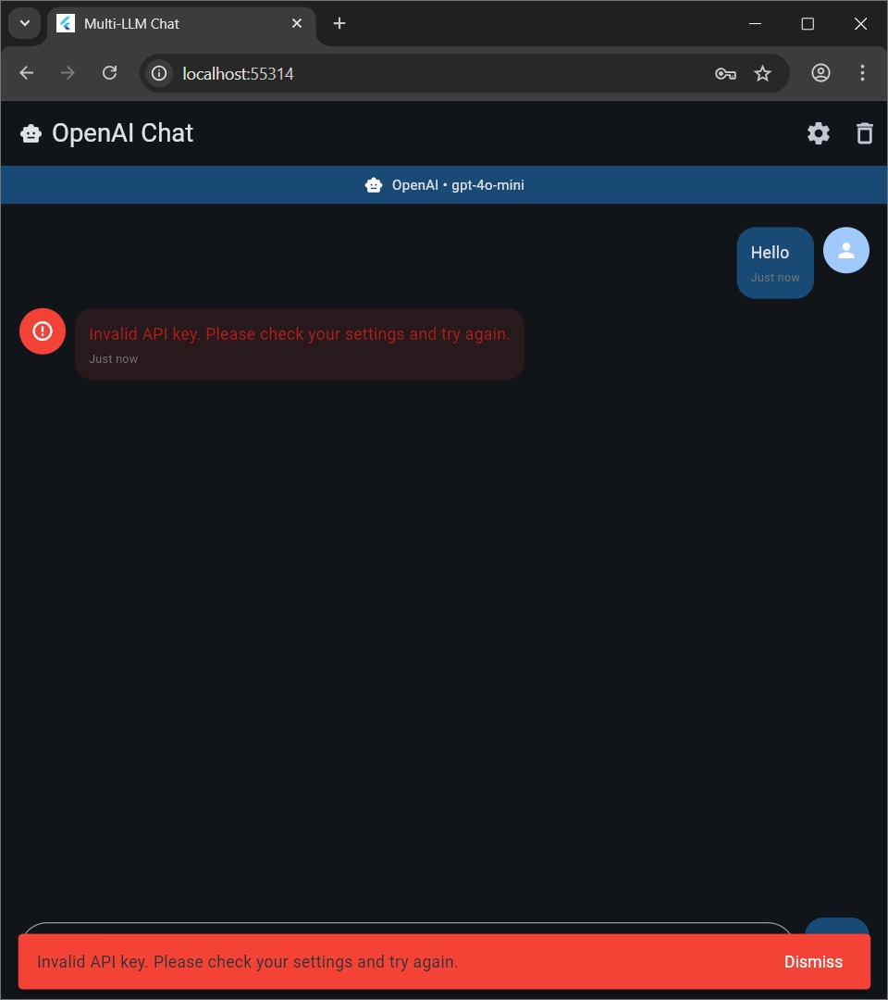

# AIVerse 🌌

<div align="center">


[](https://flutter.dev)
[](LICENSE)
[](CONTRIBUTING.md)

**A universal chat interface for multiple AI language models in a single Flutter app**

[Features](#-features) • [Installation](#-installation) • [Usage](#-usage) • [Supported Platforms](#-supported-platforms) 
</div>

---

## 📱 About

AIVerse is a production-grade Flutter application that provides a unified chat interface for multiple AI language model providers. Switch seamlessly between Groq, OpenAI, Anthropic, and Google Gemini - all in one beautiful app.

### ✨ Key Highlights

- 🚀 **Single Dart File** - Entire app in one file for easy understanding
- 🔄 **Multi-Platform Support** - 4 major LLM providers integrated
- 🎨 **Material 3 Design** - Modern, beautiful UI with dark mode
- 🛡️ **Production-Ready** - Comprehensive error handling and validation
- 🔒 **Privacy-First** - Your API keys never leave your device
- ⚡ **Fast & Lightweight** - Minimal dependencies, maximum performance

---

## 🎯 Features

### Core Features
- ✅ **Multiple LLM Providers**
  - Groq (Llama 3.3, Mixtral, Gemma)
  - OpenAI (GPT-4o, GPT-4o-mini, GPT-3.5-turbo)
  - Anthropic (Claude 3.5 Sonnet, Haiku, Opus)
  - Google Gemini (1.5 Pro, Flash)

- ✅ **Advanced Settings**
  - Temperature control (0.0 - 2.0)
  - Max tokens adjustment (256 - 4096)
  - Model selection per platform
  - API key management with validation

- ✅ **User Experience**
  - Real-time chat interface
  - Message timestamps
  - Loading indicators
  - Error handling with user-friendly messages
  - Clear chat functionality
  - Auto-scroll to latest messages

- ✅ **Developer Features**
  - Single-file architecture
  - Clean, documented code
  - Production-grade error handling
  - API key format validation
  - Network timeout handling

---

## 🖼️ Screenshots

<div align="center">

| Chat Interface | Settings Dialog | Error Handling |
|:-:|:-:|:-:|
|  |  |  |

</div>

---

## 🚀 Installation

### Prerequisites
- Flutter SDK (3.0 or higher)
- Dart SDK (2.17 or higher)
- Android Studio / VS Code / Xcode
- API keys from at least one provider

### Step 1: Clone the Repository
```bash
git clone https://github.com/yourusername/aiverse.git
cd aiverse
```

### Step 2: Install Dependencies
```bash
flutter pub get
```

### Step 3: Run the App
```bash
# For development
flutter run

# For release build
flutter build apk --release  # Android
flutter build ios --release  # iOS
```

---

## 📦 Dependencies

Add these to your `pubspec.yaml`:

```yaml
dependencies:
  flutter:
    sdk: flutter
  http: ^1.1.0

dev_dependencies:
  flutter_test:
    sdk: flutter
  flutter_lints: ^3.0.0
```

---

## 🔑 Getting API Keys

You'll need API keys from the providers you want to use:

| Provider | Get Your API Key | Free Tier |
|----------|------------------|-----------|
| 🚀 Groq | [console.groq.com/keys](https://console.groq.com/keys) | ✅ Yes |
| 🤖 OpenAI | [platform.openai.com/api-keys](https://platform.openai.com/api-keys) | ✅ Limited |
| 🧠 Anthropic | [console.anthropic.com/settings/keys](https://console.anthropic.com/settings/keys) | ✅ Limited |
| ⭐ Google Gemini | [makersuite.google.com/app/apikey](https://makersuite.google.com/app/apikey) | ✅ Yes |

---

## 💡 Usage

### Basic Usage

1. **Launch the app** - On first launch, you'll see the settings dialog
2. **Select a platform** - Choose from Groq, OpenAI, Anthropic, or Gemini
3. **Select a model** - Pick your preferred model for that platform
4. **Enter API key** - Paste your API key (it's validated automatically)
5. **Adjust settings** - Optional: Tweak temperature and max tokens
6. **Start chatting!** - Type your message and get AI responses

### Advanced Configuration

```dart
// Default settings (can be changed in Settings dialog)
Temperature: 0.7        // Balance between focused and creative
Max Tokens: 1024        // Response length limit
```

### Switching Platforms

- Tap the **Settings** icon (⚙️) in the app bar
- Select a different platform
- Choose a model
- Enter the corresponding API key
- Save and start chatting

---

## 🏗️ Architecture

### Single-File Structure

```
lib/main.dart
├── MultiLLMChatApp (MaterialApp)
├── PlatformConfig (Configuration for each LLM provider)
├── ApiException (Custom exception handling)
├── ChatScreen (Main chat interface)
│   ├── API call methods
│   ├── Error handling
│   └── UI components
├── SettingsDialog (Configuration dialog)
└── ChatBubble (Message display widget)
```

### Error Handling Flow

```
User Input → Validation → API Call → Response
                ↓            ↓         ↓
         Input Error   Network Error  Success
                ↓            ↓         ↓
            Show Error   Show Error  Display
```

---

## 🛠️ Supported Platforms

### Target Platforms
- ✅ Android (API 21+)
- ✅ iOS (iOS 12+)
- ✅ Web (Chrome, Firefox, Safari)
- ✅ Windows
- ✅ macOS
- ✅ Linux

### Tested On
- Android 10+
- iOS 14+
- Chrome 90+

---

### Development Setup

1. Fork the repository
2. Create a feature branch
   ```bash
   git checkout -b feature/amazing-feature
   ```
3. Make your changes
4. Test thoroughly
5. Commit your changes
   ```bash
   git commit -m 'Add amazing feature'
   ```
6. Push to the branch
   ```bash
   git push origin feature/amazing-feature
   ```
7. Open a Pull Request

See [CONTRIBUTING.md](CONTRIBUTING.md) for detailed guidelines.

---

## 📋 Roadmap

### Version 1.0 (Current)
- [x] Multi-platform LLM support
- [x] Basic chat interface
- [x] Settings management
- [x] Error handling

### Version 1.1 (Planned)
- [ ] Chat history persistence
- [ ] Export conversations
- [ ] Multiple conversation threads
- [ ] Search functionality

### Version 2.0 (Future)
- [ ] Image support (for vision models)
- [ ] Streaming responses
- [ ] Custom system prompts
- [ ] Cost tracking
- [ ] Conversation templates

See [ROADMAP.md](ROADMAP.md) for details.

---

## ⚠️ Important Notes

### Privacy & Security
- ✅ All API keys are stored locally on your device
- ✅ No data is sent to any server except the chosen AI provider
- ✅ Chat history is not persisted (privacy by default)
- ✅ Open source - audit the code yourself

### API Usage & Costs
- You are responsible for API usage costs
- Monitor your usage on each provider's dashboard
- Set spending limits on provider platforms
- Free tiers have rate limits

### Legal Considerations
- This app is for personal/educational use
- Review each provider's Terms of Service
- Comply with usage policies
- Not affiliated with any AI provider

---

## 📄 License

This project is licensed under the MIT License - see the [LICENSE](LICENSE) file for details.

```
MIT License

Copyright (c) 2025 AIVerse Contributors

Permission is hereby granted, free of charge, to any person obtaining a copy
of this software and associated documentation files (the "Software"), to deal
in the Software without restriction, including without limitation the rights
to use, copy, modify, merge, publish, distribute, sublicense, and/or sell
copies of the Software, and to permit persons to whom the Software is
furnished to do so, subject to the following conditions:

The above copyright notice and this permission notice shall be included in all
copies or substantial portions of the Software.
```

---

## 🙏 Acknowledgments

- [Flutter](https://flutter.dev) - UI framework
- [Groq](https://groq.com) - Fast AI inference
- [OpenAI](https://openai.com) - GPT models
- [Anthropic](https://anthropic.com) - Claude models
- [Google](https://ai.google.dev) - Gemini models
- All contributors who help improve AIVerse

---

## 📊 Project Stats


---

<div align="center">

**Made with ❤️ by the AIVerse Community**

[⬆ Back to Top](#aiverse-)

</div>
